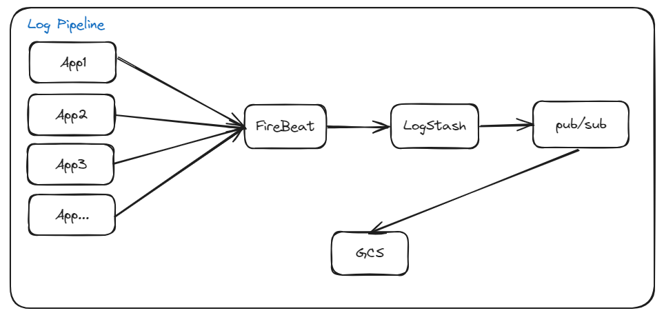

## Log 파이프라인



1. Appplication을 실행시키고
2. Firebeat/Logstash를 이용해 collection.  
3. 최종적으로 pub/sub으로 쏘고, gcs에 저장하는 파이프라인. 

```
# logstash.conf 파일에 있는 project_id 수정 필요.
# credential.json 에 pub/sub administora권한 필요. 
# pub/sub에 등록되어있는 gcs 필요.

sh run_server.sh

logs -f <container-name>
>> User 259: Recommended item 27 with score 0.29

해당로그의 위치는
cat ./app*/logs/recommendation.log

```

